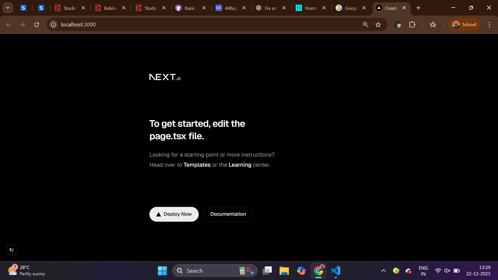

**Sparks Rentals — Next.js (TypeScript) App**

A modern rental platform front‑end scaffolded with Next.js 16 (TypeScript), App Router, and Tailwind CSS. The goal is to deliver a reliable, scalable UI for listing rentals, search, booking flows, and account management, with a structure that accelerates future sprints.

**Folder Structure**
- **Location:** The app is scaffolded in [s81-1225-sparks-nextjs-aws-rentels](s81-1225-sparks-nextjs-aws-rentels) using the `src/` directory.
- **Tree:**

```
src/
├── app/          # Routes & pages (App Router)
├── components/   # Reusable UI components
├── lib/          # Utilities, helpers, configs
```

- **[src/app](s81-1225-sparks-nextjs-aws-rentels/src/app):** Route folders contain `page.tsx`, `layout.tsx`, and optional `route.ts` for API endpoints.
- **[src/components](s81-1225-sparks-nextjs-aws-rentels/src/components):** Presentation‑focused, reusable UI components. Prefer PascalCase and minimal props.
- **[src/lib](s81-1225-sparks-nextjs-aws-rentels/src/lib):** Pure utilities, configs, clients, and shared logic. Keep React‑free for easy testing.

**Naming Conventions**
- **Components:** PascalCase (e.g., Button.tsx, Header.tsx)
- **Hooks/Utils:** camelCase (e.g., useAuth.ts, formatDate.ts)
- **Non‑component files/folders:** kebab-case (e.g., api-client.ts, date-utils/)
- **App routes:** Folder-based under `src/app` (e.g., `src/app/dashboard/page.tsx`)
- **Imports:** Use alias `@/*` for `src` (e.g., `import { Button } from '@/components/Button'`)

**Setup & Local Run**
- Prerequisites: Node.js 18+ and npm.
- Install and run:

```powershell
cd s81-1225-sparks-nextjs-aws-rentels
npm install
npm run dev
```

- Open the app at http://localhost:3000
- `.gitignore` excludes `node_modules`, `.next/`, `coverage/`, `.env*`, etc. See [s81-1225-sparks-nextjs-aws-rentels/.gitignore](s81-1225-sparks-nextjs-aws-rentels/.gitignore).

**Reflection: Why this structure? How it scales**
- **Separation of concerns:** Routing in `app`, UI in `components`, logic in `lib` keeps boundaries clear and code focused.
- **Modular growth:** New features slot into `src/app/feature/*`, shared UI lives in `components`, and shared logic in `lib` without cross‑coupling.
- **Discoverability:** Predictable locations and naming reduce cognitive load and speed up onboarding.
- **Testability:** Pure functions in `lib` are straightforward to unit test; components remain presentational.
- **Team velocity:** The `@/*` import alias and consistent conventions reduce friction, enabling faster iteration in future sprints.

**Project Overview**
- **Stack:** Next.js 16 (TypeScript) with App Router and Tailwind CSS.
- **Location:** Project scaffolded in [s81-1225-sparks-nextjs-aws-rentels](s81-1225-sparks-nextjs-aws-rentels) with `src/` enabled.

**Folder Structure**
- **[src/app](s81-1225-sparks-nextjs-aws-rentels/src/app):** Routes, layouts, and pages using the App Router (`page.tsx`, `layout.tsx`, `route.ts` for API).
- **[src/components](s81-1225-sparks-nextjs-aws-rentels/src/components):** Reusable UI components that are presentation-focused and stateless when possible.
- **[src/lib](s81-1225-sparks-nextjs-aws-rentels/src/lib):** Utilities, helpers, configs, and non-React logic (formatters, clients, constants).

**Naming Conventions**
- **Components:** PascalCase (e.g., Button.tsx, Header.tsx).
- **Hooks/Utils:** camelCase (e.g., useAuth.ts, formatDate.ts).
- **Files & Folders:** kebab-case when not React components (e.g., api-client.ts, date-utils/).
- **App routes:** Folder-based routes under `src/app` (e.g., `src/app/dashboard/page.tsx`).
- **Imports:** Use `@/*` import alias for `src` (e.g., import { Button } from '@/components/Button').

**Scalability & Clarity**
- **Separation of concerns:** UI lives in components, logic in lib, routing in app for clean boundaries.
- **Modular growth:** New features add routes under app/feature, shared UI in components, and shared logic in lib.
- **Discoverability:** Predictable locations reduce cognitive load and onboarding time.
- **Testability:** Pure functions in lib are easy to unit test; components stay focused on rendering.

**Run Locally**
- From the workspace root:

```powershell
cd s81-1225-sparks-nextjs-aws-rentels
npm run dev
```
- App serves on http://localhost:3000.



**Workflow & Collaboration**
- **Branching Strategy:** Use consistent branch names for clarity and traceability.
	- feature/<feature-name>
	- fix/<bug-name>
	- chore/<task-name>
	- docs/<update-name>
	- Examples: `feature/login-auth`, `fix/navbar-alignment`, `docs/update-readme`.
- **PR Template:** All pull requests should use the template at [.github/pull_request_template.md](.github/pull_request_template.md).
- **Code Review Checklist:** Reviewers confirm:
	- Code follows naming conventions and structure
	- Functionality verified locally
	- No console errors or warnings
	- ESLint and Prettier checks pass
	- Comments and documentation are meaningful
	- Sensitive data is not exposed
- **Status Checks (CI):** PRs and pushes run lint, build, and optional tests via GitHub Actions workflow at [.github/workflows/ci.yml](.github/workflows/ci.yml).

**Branch Protection Rules**
- Configure in GitHub: Repository → Settings → Branches → Branch protection rules.
- Protect `main` with:
	- Require pull request reviews before merging
	- Require status checks to pass (select CI jobs: "Lint", "Build", and "Tests")
	- Disallow direct pushes to `main`
	- Require PRs to be up to date before merging
- Add a screenshot of your configured protection rules to document enforcement.

**PR Evidence & Screenshots**
- Include screenshots or console outputs showing checks passing or review comments resolved in your PR.
- Add a screenshot of a real PR with all CI checks passing and reviewer feedback addressed.

**Why this Workflow?**
- **Quality:** Enforces lint/build checks and standardized reviews.
- **Clarity:** Branch naming and PR template make intent obvious.
- **Velocity:** Clear rules reduce back-and-forth and avoid broken main.
- **Security:** Review and CI reduce risk of leaking sensitive data.
Rental nextjs project!!!
# Rental Next.js Project

This project demonstrates **Static Rendering (SSG)**, **Dynamic Rendering (SSR)**, and **Hybrid Rendering (ISR)** using the **Next.js App Router**. It is also fully containerized for a seamless development experience.

---

## 🎯 TypeScript & ESLint Configuration

This project is configured with **strict TypeScript settings**, **ESLint + Prettier integration**, and **pre-commit hooks** to ensure code quality and consistency across the team.

### 📋 TypeScript Strict Mode
Our `tsconfig.json` is configured with strict compiler options to catch potential errors early.

### 🎨 ESLint & Prettier Rules
We use ESLint 9 with a flat config and Prettier for consistent formatting.

### 🪝 Pre-Commit Hooks
Husky and lint-staged automatically run checks before each commit.

---

## 🔐 Environment Variable Management

This project uses environment variables to manage configuration and sensitive data securely.

### Setup Instructions
1. Copy `.env.example` and rename it to `.env.local`
2. Fill in actual values
3. Restart the development server

```bash
cp .env.example .env.local
npm run dev
```

---

## 🐳 Docker & Compose Setup for Local Development

This project is containerized using Docker and Docker Compose to ensure a consistent local development environment that mirrors production. This setup eliminates the "it works on my machine" problem by bundling the app, database, and cache together.

### 🚀 Running the Stack

To start all services with a single command, run the following in the root directory:

```bash
docker-compose up --build
```

Once running, you can access:
- **Next.js App**: [http://localhost:3000](http://localhost:3000)
- **PostgreSQL**: `localhost:5432`
- **Redis**: `localhost:6379`

### 🏗️ Service Architecture

The `docker-compose.yml` file defines three core services:

1.  **`app` (Next.js)**:
    - **Build**: Uses the local `Dockerfile`.
    - **Dockerfile Logic**: Based on `node:20-alpine`. It installs dependencies, copies the source code, builds the production-ready Next.js app, and starts it on port 3000.
    - **Dependencies**: Depends on `db` and `redis` to ensure they are started first.
2.  **`db` (PostgreSQL)**:
    - **Image**: `postgres:15-alpine`.
    - **Volume**: Uses `db_data` for data persistence, ensuring your database remains intact even if the container is stopped or removed.
    - **Network**: Accessible within the container network as `db:5432`.
3.  **`redis` (Redis Cache)**:
    - **Image**: `redis:7-alpine`.
    - **Purpose**: Used for high-performance caching.

### 🌐 Networking & Volumes

-   **Networks**: All services are connected via a shared bridge network named `localnet`. This allows the Next.js app to connect to the database using the hostname `db` and to Redis using `redis`.
-   **Volumes**: The `db_data` volume is mapped to `/var/lib/postgresql/data` inside the PostgreSQL container to persist database records.

### 📝 Reflections & Troubleshooting

#### Issues Faced & Solutions
-   **Project Structure**: Initially, the source code was in a nested subfolder. This caused pathing issues in the Dockerfile. **Solution**: Moved all project files to the root directory to simplify the build context and follow standard practices.
-   **Environment Variables**: The app requires specific variables like `DATABASE_URL` and `REDIS_URL` at runtime. **Solution**: Configured these directly in `docker-compose.yml` to point to the internal container names (`db` and `redis`).
-   **Build Performance**: Large images can be slow to pull and build. **Solution**: Used `alpine` versions of all images (Node, Postgres, Redis) to keep the footprint small and the builds fast. Added a `.dockerignore` file to prevent copying `node_modules` and `.next` folder into the image twice.

#### Troubleshooting Tips
-   **Port Conflicts**: If the build fails with a port error, ensure no other service is using ports 3000, 5432, or 6379 on your host machine.
-   **Clean Slate**: To reset your environment completely, run:
    ```bash
    docker-compose down -v --rmi all
    ```
